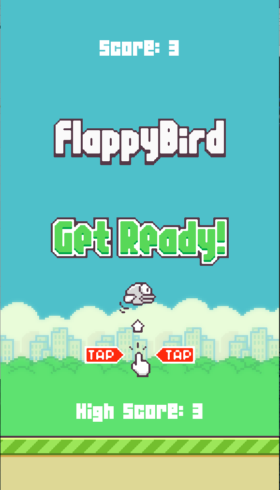

# FlaBir

<h2> Introduction </h2>

<p> This is a Flappy Bird clone created using pygame. It was created while following <a href="https://github.com/clear-code-projects">@clear-code-projects</a>' tutorial.
</p>  
  
<h2>Installation</h2>

<p> Clone the repository using :
  
  ```
  git clone https://github.com/InvincibleJuggernaut/FlaBir.git
  ```

  </p>
  <p> Once inside the downloaded directory, install the pre-requisites using :
  
  ```
  pip3 install -r requirements.txt
  ```
  </p>
 
 <h2>Screenshots</h2>
 
<p>Start</p>
 <p align="center">
 
  </p>
  <br>
  <br>

<p>Play</p>
 <p align="center">
 
  </p>
  <br>
  <br>
<p>High Score</p>
  <p align="center">
 
  </p>


